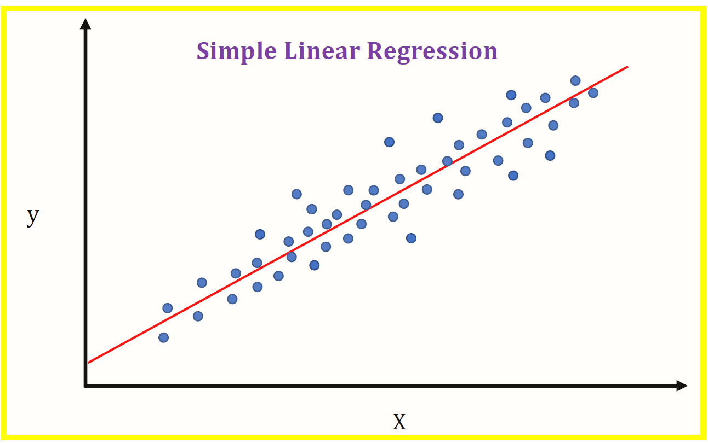

# Build_Regression_Models_From_Scratch

readme_content = """
# 📈 Linear Regression from Scratch (Python + NumPy)

This repository demonstrates how to implement **Linear Regression** from scratch using Python and NumPy.  
It explains the **mathematics (slope & intercept formulas)**, provides a simple implementation, and shows predictions.

---

## 🧮 Mathematical Formulas

For a simple linear regression model:

\`
y = β₀ + β₁x
\`

Where:
- **β₀ (Intercept)** = Mean of `y` − β₁ × Mean of `x`
- **β₁ (Slope)** = Σ((xᵢ − x̄)(yᵢ − ȳ)) / Σ((xᵢ − x̄)²)

### Formula Breakdown:

- **Slope (β₁):**  
\`
β₁ = (Σ(xᵢ − x̄)(yᵢ − ȳ)) / (Σ(xᵢ − x̄)²)
\`  

- **Intercept (β₀):**  
\`
β₀ = ȳ − β₁x̄
\`  

---

